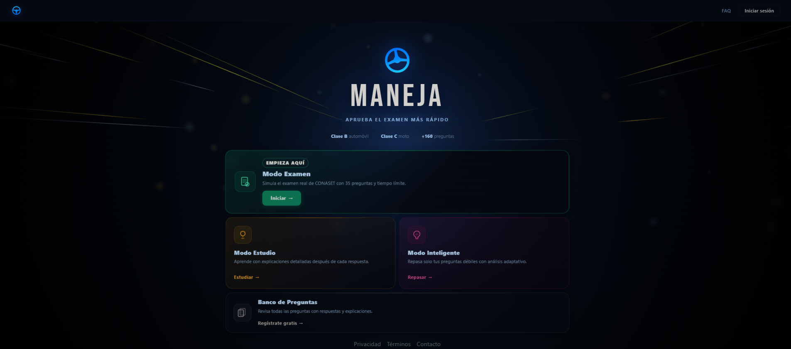
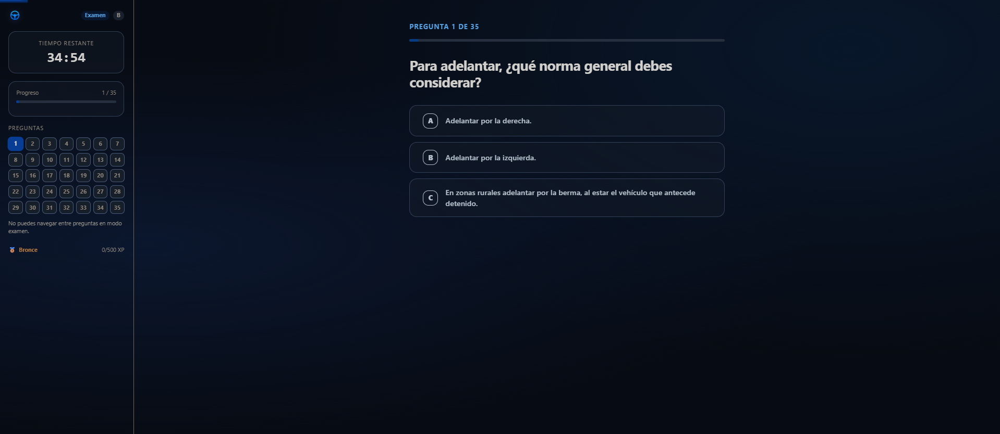
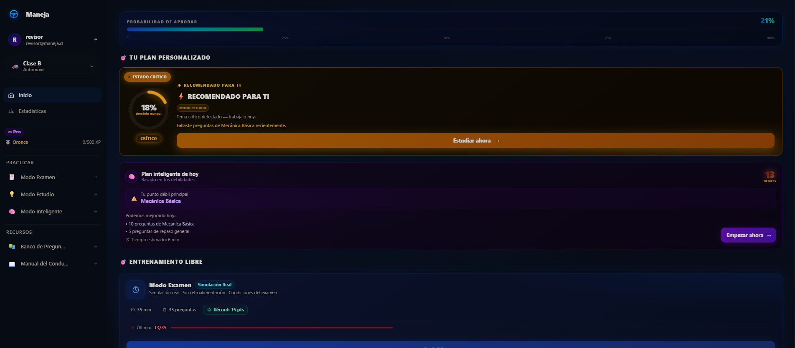

<h1 align="center">
  <br/>
  Maneja
</h1>

<p align="center">
  <a href="./LICENSE"></a>
  
  
  
  
</p>

<p align="center">
  <b><a href="#-español">🇪🇸 Español</a></b> &nbsp;|&nbsp; <b><a href="#-english">🇬🇧 English</a></b>
</p>

<p align="center">
  <a href="https://manejacl-full.vercel.app/"><b>Ver Demo en vivo / Live Demo</b></a>
</p>

<p align="center">
  <a href="https://play.google.com/store/apps/details?id=cl.maneja.app">
    
  </a>
</p>

---

## 🇪🇸 Español

Simulador de práctica para la licencia de conducir en Chile (Clase B y C), con un sistema de repaso adaptativo tipo SM-2 que prioriza las preguntas que más te cuestan, en vez de mostrarte siempre el banco completo al azar.

> Nació de la misma lógica que [Vuela](https://github.com/erikurt9/Vuela): estudiando para mi propia licencia noté que los simuladores existentes tratan todas las preguntas por igual — construí uno que en cambio recuerda en qué fallas y te hace repasar eso primero.

###  Capturas de pantalla

| Inicio | Modo Examen | Dashboard |
|---|---|---|
|  |  |  |

###  Funcionalidades

- **Modo Examen**: simulacro cronometrado con el mismo formato que el examen real (44 preguntas, 2 dobles, 33 para aprobar).
- **Modo Estudio**: practica libre por categoría, con retroalimentación inmediata.
- **Modo Inteligente (adaptativo)**: algoritmo tipo SM-2 (repetición espaciada) que prioriza preguntas falladas recientemente y espacia las que ya dominas, en vez de repetir todo el banco al azar.
- **Dashboard de progreso**: racha de días, probabilidad estimada de aprobar en base a tus últimos simulacros, categorías más débiles y cobertura del banco de preguntas.
- **Clase B y C**: banco de preguntas separado para auto/camioneta (215 preguntas) y motocicleta (57 preguntas).
- **Freemium con Mercado Pago / RevenueCat**: examen completo gratis limitado, desbloqueo premium vía suscripción.
- **App nativa Android** vía Capacitor, [disponible en Google Play](https://play.google.com/store/apps/details?id=cl.maneja.app).

###  Seguridad: Row Level Security con `WITH CHECK`

Este proyecto pasó por una revisión de seguridad enfocada en Supabase (con ayuda de [React Doctor](https://react.doctor)) que encontró y cerró un problema real, no cosmético:

Las políticas RLS originales usaban `for all using (auth.uid() = user_id)` **sin** `with check`. En PostgreSQL/PostgREST, la cláusula `USING` solo protege lecturas y actualizaciones de filas que **ya existen** — la única cláusula que valida un `INSERT` es `WITH CHECK`. Como ninguna de las 5 tablas (`examenes`, `respuestas_detalle`, `rachas`, `profiles`, `pregunta_stats`) la tenía, un cliente con la anon key (pública, va en el bundle de cualquier app) podía en teoría insertar filas con el `user_id` de otra persona sin que RLS lo bloqueara.

La solución aplicada, igual en las 5 tablas:
1. `WITH CHECK (auth.uid() = user_id)` en cada política, para que el `INSERT` también se valide.
2. `DEFAULT auth.uid()` en la columna del dueño de la fila, para que el cliente **ya no necesite mandar ese campo en absoluto** — ni por error ni a propósito.
3. Se retiró del código de cliente toda escritura explícita de `user_id`/`id` (eran correctas en valor, pero el patrón en sí era el riesgo).

Ver [`migration_authz_fields.sql`](./migration_authz_fields.sql) para el script completo.

###  Stack tecnológico

| Capa | Tecnología |
|---|---|
| Frontend | React 19 + Vite |
| Estado | Zustand |
| Animación | Framer Motion |
| Empaquetado nativo | Capacitor (Android) |
| Backend | Supabase (Postgres + Auth + Row Level Security) |
| Pagos | Mercado Pago + RevenueCat |
| Analítica | Vercel Analytics |

###  Instalación

```bash
git clone https://github.com/erikurt9/Maneja.git
cd Maneja
npm install
```

Copia `.env.example` a `.env` y completa tus credenciales:

```bash
cp .env.example .env
```

```
VITE_SUPABASE_URL=https://tu-proyecto.supabase.co
VITE_SUPABASE_ANON_KEY=tu-clave-publica
VITE_FORCE_PREMIUM=false
```

#### Configuración de Supabase

1. Crea un proyecto en [supabase.com](https://supabase.com).
2. Ejecuta `supabase_setup.sql` en el SQL Editor para crear las tablas.
3. Ejecuta `migration_authz_fields.sql` para aplicar las políticas RLS con `WITH CHECK` (ver sección de seguridad arriba).

###  Desarrollo

```bash
npm run dev       # servidor de desarrollo
npm run build     # build de producción
npm run preview   # preview del build
```

#### Build de Android (Capacitor)

```bash
npm run build
npx cap sync android
npx cap open android
```

###  Licencia

Este proyecto está bajo licencia MIT — ver [LICENSE](./LICENSE). El contenido de las preguntas está basado en normativa pública de tránsito chilena y se ofrece con fines educativos.

<p align="right"><a href="#maneja">⬆ Volver arriba</a></p>

---

## 🇬🇧 English

A practice simulator for the Chilean driving license (Class B and C), with an SM-2-style adaptive review system that prioritizes the questions you struggle with most, instead of always showing the full question bank at random.

> It came from the same idea behind [Vuela](https://github.com/erikurt9/Vuela): while studying for my own license I noticed existing simulators treat every question the same — so I built one that remembers what you get wrong and makes you review that first.

###  Screenshots

| Home | Exam Mode | Dashboard |
|---|---|---|
|  |  |  |

###  Features

- **Exam Mode**: timed mock exam matching the real format (44 questions, 2 double-weighted, 33 to pass).
- **Study Mode**: free practice by category with immediate feedback.
- **Smart Mode (adaptive)**: SM-2-style spaced-repetition algorithm that prioritizes recently-missed questions and spaces out ones you've mastered, instead of cycling through the whole bank randomly.
- **Progress dashboard**: daily streak, estimated pass probability based on your recent mock exams, weakest categories, and question-bank coverage.
- **Class B and C**: separate question banks for car/truck (215 questions) and motorcycle (57 questions).
- **Freemium with Mercado Pago / RevenueCat**: limited free full exam, premium unlock via subscription.
- **Native Android app** via Capacitor, [available on Google Play](https://play.google.com/store/apps/details?id=cl.maneja.app).

###  Security: Row Level Security with `WITH CHECK`

This project went through a Supabase-focused security review (using [React Doctor](https://react.doctor)) that found and closed a real, non-cosmetic issue:

The original RLS policies used `for all using (auth.uid() = user_id)` **without** `with check`. In PostgreSQL/PostgREST, `USING` only protects reads and updates of rows that **already exist** — the only clause that validates an `INSERT` is `WITH CHECK`. Since none of the 5 tables (`examenes`, `respuestas_detalle`, `rachas`, `profiles`, `pregunta_stats`) had it, a client holding the anon key (public, ships in any app's bundle) could in theory insert rows with another user's `user_id` without RLS blocking it.

The fix, applied identically across all 5 tables:
1. `WITH CHECK (auth.uid() = user_id)` on every policy, so `INSERT` is validated too.
2. `DEFAULT auth.uid()` on the row-owner column, so the client **no longer needs to send that field at all** — not by mistake, not on purpose.
3. Removed every explicit client-side write of `user_id`/`id` from the codebase (the values were correct, but the pattern itself was the risk).

See [`migration_authz_fields.sql`](./migration_authz_fields.sql) for the full script.

###  Tech stack

| Layer | Technology |
|---|---|
| Frontend | React 19 + Vite |
| State | Zustand |
| Animation | Framer Motion |
| Native packaging | Capacitor (Android) |
| Backend | Supabase (Postgres + Auth + Row Level Security) |
| Payments | Mercado Pago + RevenueCat |
| Analytics | Vercel Analytics |

###  Installation

```bash
git clone https://github.com/erikurt9/Maneja.git
cd Maneja
npm install
```

Copy `.env.example` to `.env` and fill in your credentials:

```bash
cp .env.example .env
```

```
VITE_SUPABASE_URL=https://your-project.supabase.co
VITE_SUPABASE_ANON_KEY=your-publishable-key
VITE_FORCE_PREMIUM=false
```

#### Supabase setup

1. Create a project at [supabase.com](https://supabase.com).
2. Run `supabase_setup.sql` in the SQL Editor to create the tables.
3. Run `migration_authz_fields.sql` to apply the RLS policies with `WITH CHECK` (see the security section above).

###  Development

```bash
npm run dev       # development server
npm run build     # production build
npm run preview   # preview the build
```

#### Android build (Capacitor)

```bash
npm run build
npx cap sync android
npx cap open android
```

###  License

This project is licensed under the MIT License — see [LICENSE](./LICENSE). Question content is based on publicly available Chilean traffic regulations and is provided for educational purposes.

<p align="right"><a href="#maneja">⬆ Back to top</a></p>
